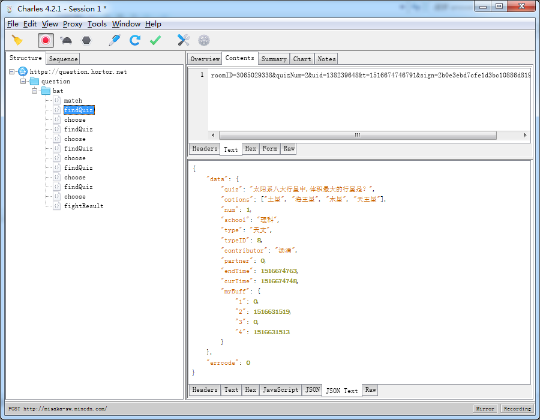
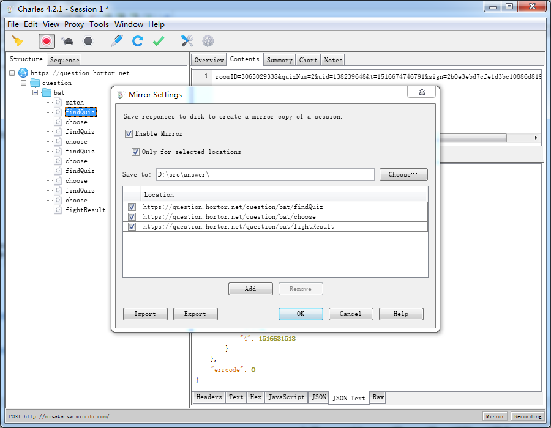
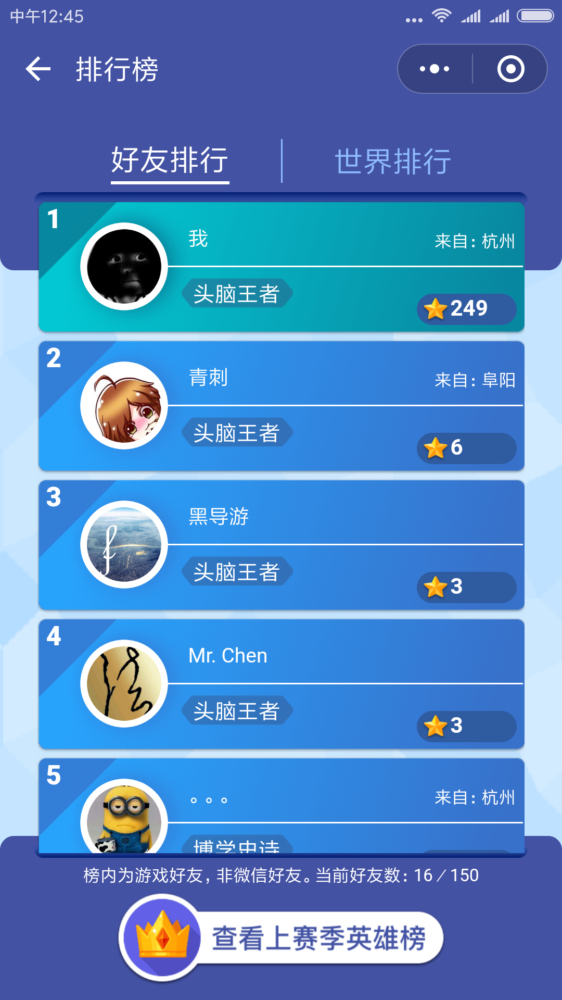

# Python头脑王者答题器

## 效果
[视频](http://v.youku.com/v_show/id_XMzM0Mzk0MDQ0MA==.html?spm=a2h3j.8428770.3416059.1)

## 原理说明

1. 通过 Charles抓包，获取 https://question.hortor.net/question/bat/ 返回的json数据，并保存成文件


2. 通过watchdog监测question.hortor.net/question/bat/目下文件的变化，去响应对应的方法
```
class FileEventHandler(FileSystemEventHandler):
	def __init__(self):
		FileSystemEventHandler.__init__(self)
	
	def on_created(self,event):
		global quiz
		if event.src_path.split('/')[-1] == 'findQuiz':
			with open('question.hortor.net/question/bat/findQuiz', encoding='utf-8') as f:
				quiz=read_question(f)
		elif event.src_path.split('/')[-1] == 'choose':
			sql.sql_write(quiz)
		elif event.src_path.split('/')[-1] == 'fightResult':
			print('fightresult')
			time.sleep(3)
			adbshell.back()
			time.sleep(3)
			adbshell.tap('start')
```

3.获取题目后，如果题目在数据库中，直接返回答案。否则通过百度搜索题目信息，并统计选项出现的次数，出现的最多的选项就当作答案。

4.通过adb shell input tab 模拟点击选项(自动版的只在小米6上试过)

## 使用教程

- 0x01	Charles配置
	Proxy->Recording Settings

	Proxy->SSL Proxying Settings

	Tools->Mirror

	安装SSL证书 https://www.jianshu.com/p/5539599c7a25
- 0x02	手机和电脑连接同一个wifi后.运行answer.py或者answer(手动).exe

- 0x03	开始排位即可

## 结果




